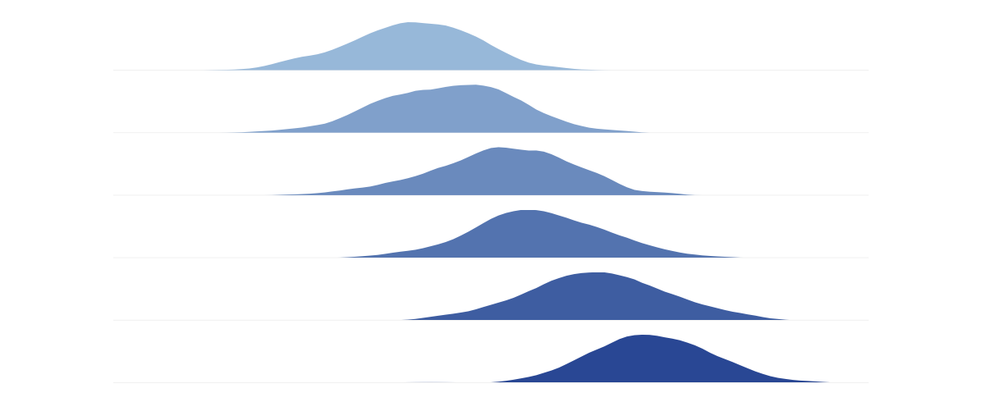

<!-- Try different approaches for the image -->

<!-- Alternative image paths - uncomment to test:

-->

## Project Goals
- Develop advanced algorithms for detecting subtle EEG changes
- Create prediction models for neurological outcomes after critical illness
- Establish best practices for EEG monitoring in pediatric intensive care
- Translate research findings into clinical applications

## Key Accomplishments
- Implemented continuous EEG monitoring protocols
- Published findings on correlation between EEG patterns and outcomes
- Developed a database of pediatric EEG recordings for research
- Collaborated with multiple centers to validate findings