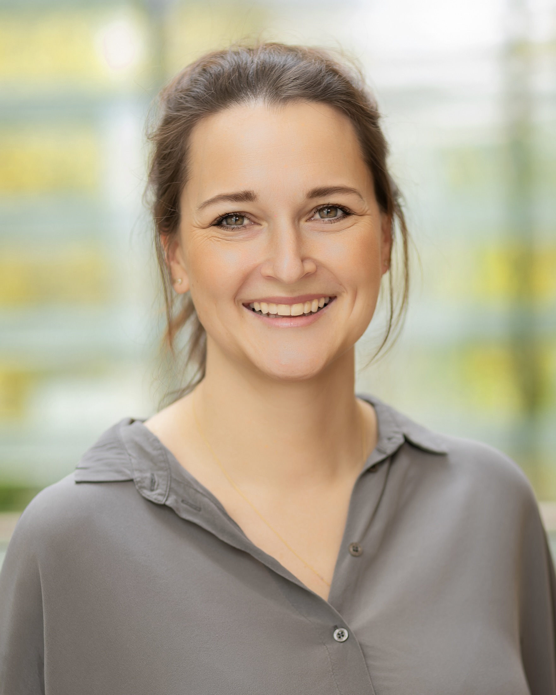
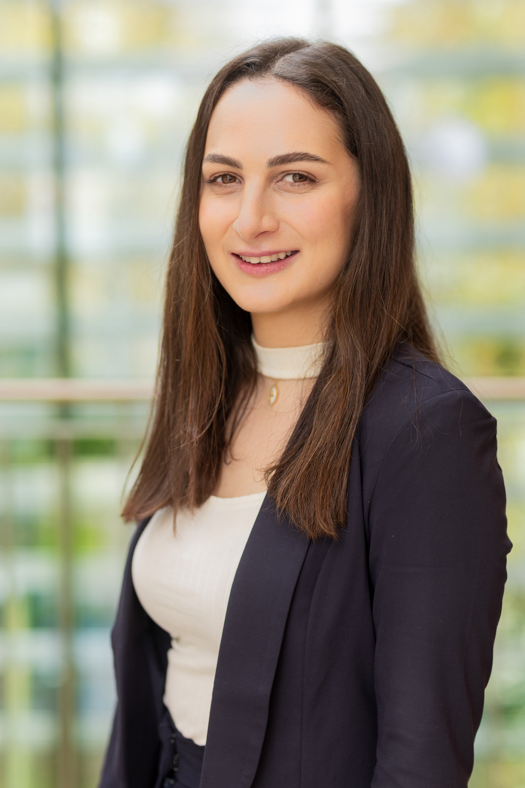

    <h2 class="text-uppercase text-uke-blue font-weight-bold ume-mitarbeiter-wrapper__headline">Lead</h2>
    

        

            
            

                

                    

                        PD Dr. med. Nora Bruns, PhD
                    

                    
Specialist in Pediatrics and Pediatric Intensive Care

                    
<a href="mailto:nora.bruns@uk-essen.de">nora.bruns@uk-essen.de</a>

                

            

        

        
        

            
            

                

                    

                        Prof. Dr. med. Christian Dohna-Schwake
                    

                    
Specialist in Pediatrics and Pediatric Intensive Care

                    
<a href="mailto:christian.dohna-schwake@uk-essen.de">christian.dohna-schwake@uk-essen.de</a>

                

            

        

    

    <h2 class="text-uppercase text-uke-blue font-weight-bold ume-mitarbeiter-wrapper__headline">Clinician Scientists</h2>
    

        

            
            

                

                    

                        Dr. med. Sandra Greve
                    

                    
Specialist in Pediatrics

                    
<a href="mailto:sandra.greve@uk-essen.de">sandra.greve@uk-essen.de</a>

                

            

        

        
        

            
            

                

                    

                        Dr. med. Pia Brensing
                    

                    
Resident in Pediatrics

                    
<a href="mailto:pia.brensing@uk-essen.de">pia.brensing@uk-essen.de</a>

                

            

        

        
        

            
            

                

                    

                        Dr. med. Linda von der Heiden
                    

                    
Resident in Pediatrics

                    
<a href="mailto:linda.vonderheiden@uk-essen.de">linda.heiden@uk-essen.de</a>

                

            

        

        
        

            
            

                

                    

                        Dr. med. Luisa Paul
                    

                    
Specialist in Pediatrics

                    
<a href="mailto:luisa.paul@uk-essen.de">luisa.paul@med.uni-heidelberg.de</a>

                

            

        

    

    <h2 class="text-uppercase text-uke-blue font-weight-bold ume-mitarbeiter-wrapper__headline">Doctorate Students</h2>
    

        

            
            

                

                    

                        Rayan Hojeij, MPH
                    

                    
Epidemiologist

                    
<a href="mailto:rayan.hojeij@uk-essen.de">rayan.hojeij@uk-essen.de</a>

                

            

        

    

    <h2 class="text-uppercase text-uke-blue font-weight-bold ume-mitarbeiter-wrapper__headline">Medical Students</h2>
    
Coming soon

<!-- Add necessary CSS styles for the team layout -->
