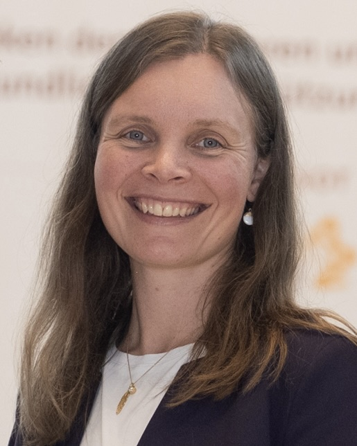
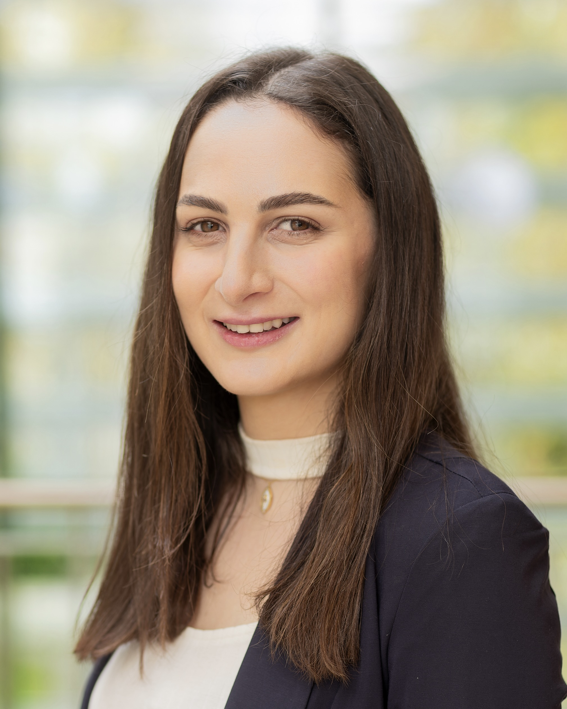

## Lead
### PD Dr. med. Nora Bruns, PhD

Specialist in Pediatrics and Pediatric Intensive Care

### Prof. Dr. med. Christian Dohna-Schwake

Specialist in Pediatrics and Pediatric Intensive Care

## Clinician scientists
### Dr. med. Sandra Greve

Specialist in Pediatrics

### Dr. med. Pia Brensing

Resident in Pediatrics

### Dr. med. Linda von der Heiden

Resident in Pediatrics

### Dr. med. Luisa Paul

Specialist in Pediatrics

## Doctorate students
### Rayan Hojeij, MPH

Epidemiologist

## Medical students
Vorname nachname??

